# Arquitectura del Viaje del Usuario y Contribuyente - SAT Guatemala

Este documento define la lógica oficial del **Viaje del Usuario (Taxpayer & User Journey)** para la organización, categorización y ordenación de trámites en el Portal Web de la SAT Guatemala a través de sus **4 Pilares Institucionales (690 trámites)**, alineado rigurosamente al documento normativo original:
📂 **`docs/Detalle de Contenido para Grupos de Interes.xlsx`**.

---

## 1. Principio Fundamental y Aclaración de Arquitectura

> [!IMPORTANT]
> **Erradicación de "Trámites comunes":** 
> La categoría "Trámites comunes" provino de una agregación artificial en una versión intermedia del árbol de navegación (`Arbol_de_Navegacion_Portal_v5.xlsx`). Conforme al archivo oficial de diseño **`Detalle de Contenido para Grupos de Interes.xlsx`**, **NO EXISTE** una categoría "Trámites comunes".
> Los trámites vehiculares, de RTU y declaraciones pertenecen legítimamente a los grupos tributarios oficiales donde opera el contribuyente (principalmente `Contribuyente General`, `Pequeños Contribuyentes`, `Contribuyentes Especiales` y `NIT sin Obligaciones`).

```
[Ingreso / Habilitación Inicial] ➔ [Operación Diaria] ➔ [Cumplimiento Periódico] ➔ [Control y Solvencias] ➔ [Modificación / Devolución] ➔ [Cierre o Cese]
```

---

## 2. Los 4 Pilares Institucionales y sus Grupos Oficiales

```mermaid
flowchart TD
    ROOT["Portal Web SAT Guatemala (690 trámites)"] --> P1["1. Contribuyentes (341)"]
    ROOT --> P2["2. Operadores de Comercio Exterior (171)"]
    ROOT --> P3["3. Profesionales (80)"]
    ROOT --> P4["4. Organismos Especiales (98)"]

    subgraph P1_SUBS["Pilar 1: Contribuyentes (4 Grupos Oficiales)"]
        P1 --> P1_NIT["1. NIT sin Obligaciones (10)"]
        P1 --> P1_PEQ["2. Pequeños Contribuyentes (22)"]
        P1 --> P1_GEN["3. Contribuyente General (295)"]
        P1 --> P1_ESP["4. Contribuyentes Especiales (14)"]
    end

    subgraph P2_SUBS["Pilar 2: Comercio Exterior"]
        P2 --> P2_IMP["Importadores (79)"]
        P2 --> P2_NOR["Normativa y Aranceles (39)"]
        P2 --> P2_EXP["Exportadores (20)"]
        P2 --> P2_TRA["Transportistas (20)"]
        P2 --> P2_AGE["Agentes Aduaneros (7)"]
        P2 --> P2_COU["Courier (3)"]
        P2 --> P2_OEA["OEA (2)"]
        P2 --> P2_ALM["Almacenes Fiscales (1)"]
    end

    subgraph P3_SUBS["Pilar 3: Profesionales"]
        P3 --> P3_SER["Servicios Profesionales (29)"]
        P3 --> P3_ABO["Abogados y Notarios (22)"]
        P3 --> P3_PER["Peritos Contadores (14)"]
        P3 --> P3_GES["Gestores Tributarios (12)"]
        P3 --> P3_AUD["Auditores (4)"]
    end

    subgraph P4_SUBS["Pilar 4: Organismos Especiales"]
        P4 --> P4_EST["Entidades del Estado (33)"]
        P4 --> P4_CON["Constitucionales (22)"]
        P4 --> P4_DEC["Decreto (20)"]
        P4 --> P4_NOL["No Lucrativos (15)"]
        P4 --> P4_MUN["Municipalidades (5)"]
        P4 --> P4_ZOL["ZOLIC (3)"]
    end
```



---

## 3. Pilar 1: Contribuyentes (340 trámites - 4 Grupos Oficiales)

Estructura canónica oficial sin categorías artificiales:

1. **`NIT sin Obligaciones` (10 trámites):** Exclusivo para personas individuales, estudiantes y graduados sin actividad económica que requieren NIT para actos civiles, cuentas bancarias, remesas, registro de títulos universitarios y acceso a información pública. **Cero trabajadores asalariados.**
   * *Nodos hijos:*
     * **Inscripción de NIT (2 trámites):** Solicitud de primer NIT y actualización de datos de identificación personal.
     * **Títulos Universitarios (2 trámites):** Registro de títulos universitarios para ejercer y verificación digital mediante código QR.
     * **Información Pública (2 trámites):** Solicitud formal de información pública y portal de información de oficio (Decreto 57-2008).
     * **Servicios en Línea y Solvencias (4 trámites):** Agencia Virtual, consulta de expedientes, Solvencia Fiscal en línea y cita previa.
2. **`Pequeños Contribuyentes` (22 trámites):** Régimen simplificado (5% IVA definitivo hasta Q150,000 anuales), agropecuario primario y pecuario.
   * *Nodos hijos:* Regímenes tributarios (10), Otros servicios al contribuyente (5), Cultura tributaria (3), Inscripción en RTU (2), Facturación electrónica (2).
3. **`Contribuyente General` (295 trámites):** Personas y empresas con obligaciones tributarias generales, Régimen Sobre las Utilidades, Opcional Simplificado, IVA General (12%), Rentas del Trabajo (asalariados), trámites del Registro Fiscal de Vehículos como propietario, declaraciones y gestiones de RTU.
   * *Nodos hijos ramificados según Ley de Miller (7 ± 2 trámites por bloque cognitivo):*
     * **RTU e Inscripción:**
       * *RTU: Inscripción de Sociedades y Empresas* (3 trámites)
       * *RTU: Inscripción de Entidades Especiales* (6 trámites)
       * *RTU: Gestión de NIT, Representantes y Contadores* (8 trámites)
       * *RTU: Actualización de Datos y Domicilio* (9 trámites)
       * *RTU: Actualización de Sociedades y Entidades* (10 trámites)
       * *RTU: Cierre y Suspensión de Negocios* (8 trámites)
       * *RTU: Cierre y Cancelación de Empresas* (6 trámites)
     * **Obligaciones, Regímenes y Facturación:**
       * *Regímenes tributarios* (8 trámites)
       * *Declaraciones, pagos y solvencias* (12 trámites)
       * *Facturación: Sistema FEL y Factura Electrónica* (5 trámites)
       * *Facturación: Autorización de Documentos e Imprentas* (8 trámites)
       * *Facturación: Constancias de Exención y Formularios* (8 trámites)
     * **Devoluciones de Impuestos:**
       * *Devoluciones: Impuesto Sobre la Renta (ISR)* (7 trámites)
       * *Devoluciones: IVA y Crédito Fiscal* (4 trámites)
       * *Devoluciones: Pagos Indebidos o en Exceso* (6 trámites)
       * *Devoluciones: Otros Impuestos y Compensaciones* (5 trámites)
     * **Registro Fiscal de Vehículos (Propietarios):**
       * *Vehículos: Inscripción y Primeras Placas* (8 trámites)
       * *Vehículos: Traspasos y Compraventa* (8 trámites)
       * *Vehículos: Traspasos Especiales* (12 trámites)
       * *Vehículos: Distintivos, Tarjeta y Placas* (10 trámites)
       * *Vehículos: Impuesto de Circulación (ISCV)* (10 trámites)
       * *Vehículos: Modificaciones y Rectificaciones* (9 trámites)
       * *Vehículos: Bajas e Inactivación* (7 trámites)
       * *Vehículos: Reactivación de Vehículos* (5 trámites)
       * *Vehículos: Consultas y Autorizaciones* (11 trámites)
     * **Servicios al Contribuyente:**
       * *Servicios: Constancias del RTU y Acreditaciones* (10 trámites)
       * *Servicios: Libros Contables y Documentos* (6 trámites)
       * *Servicios: Correcciones en Formularios y Pagos* (4 trámites)
       * *Servicios: Agencia Virtual y Claves* (6 trámites)
       * *Servicios: Citas y Atención Presencial* (7 trámites)
       * *Consultas y verificadores* (10 trámites)
     * **Capacitación y Cultura Tributaria:**
       * *Capacitación: Cursos de ISR e ISO* (9 trámites)
       * *Capacitación: Cursos de IVA e Impuestos Específicos* (9 trámites)
       * *Capacitación: Herramientas y Facturación FEL* (10 trámites)
       * *Capacitación: Eventos, Diplomados y Calendario* (9 trámites)
       * *Cultura Tributaria: Biblioteca y Materiales* (8 trámites)
       * *Cultura Tributaria: Ciudadanía y Programas NAF* (6 trámites)
       * *Cultura Tributaria: Preguntas Frecuentes y Normativa* (9 trámites)
       * *Atención, quejas y denuncias* (4 trámites)
4. **`Contribuyentes Especiales` (14 trámites):** Gerencias de Grandes y Medianos Contribuyentes Especiales, precios de transferencia y fiscalización intensiva.
   * *Nodos hijos:*
     * **Gerencias Especiales y Control Tributario (7 trámites):** Acreditación de agentes de retención, buzón y trámites en gerencias especiales.
     * **Declaraciones e Informes Especiales (5 trámites):** Informe electrónico de compras/ventas, ISR transporte internacional, alcoholes y bebidas.
     * **Capacitación y Orientación Diferenciada (2 trámites):** Cursos de retenciones y preguntas frecuentes de contribuyentes especiales.

---

## 4. Pilar 2: Operadores de Comercio Exterior (171 trámites)

1. **`Importadores` (79 trámites):** Padrón de importadores, DUCA, despacho de mercancías, valoración aduanera, manifiestos y levante aduanero.
2. **`Normativa y Aranceles` (39 trámites):** Sistema Arancelario Centroamericano (SAC), facilitación del comercio, infraestructura aduanera, Puestos de Control Interinstitucional (PCI) y combate al contrabando.
3. **`Exportadores` (20 trámites):** Padrón de exportadores, DUCA-F, Devolución de Crédito Fiscal a Exportadores y trámites de exportación definitiva.
4. **`Transportistas` (20 trámites):** Empresas de transporte internacional terrestre, aéreo y marítimo, tránsito aduanero comunitario, marchamos y manifiestos.
5. **`Agentes Aduaneros` (7 trámites):** Habilitación, garantías, pólizas y refrendo de auxiliares de la función pública aduanera.
6. **`Courier` (3 trámites):** Despacho de paquetes de entrega rápida y compras personales internacionales.
7. **`OEA` (2 trámites):** Certificación y beneficios del Operador Económico Autorizado.
8. **`Almacenes Fiscales` (1 trámite):** Depósitos aduaneros temporales y recintos de almacenamiento fiscal.

---

## 5. Pilar 3: Profesionales (81 trámites)

1. **`Servicios Profesionales` (29 trámites):** Profesionales liberales independientes, registro de títulos universitarios, colegiación y timbre profesional.
2. **`Abogados y Notarios` (22 trámites):** Traspaso electrónico de vehículos por notario, venta de especies y timbres, consulta de solvencia previa y legalizaciones.
3. **`Peritos Contadores` (14 trámites):** Registro de Contadores, acreditación bienal, libros contables, retenciones y balances.
4. **`Gestores Tributarios` (12 trámites):** Habilitación oficial de gestor tributario, carné de acreditación y representación de terceras personas.
5. **`Auditores` (4 trámites):** Contadores Públicos y Auditores (CPA), dictamen de estados financieros y auditorías fiscales.

---

## 6. Pilar 4: Organismos Especiales (98 trámites)

1. **`Entidades del Estado` (33 trámites):** Ministerios, sector público, dependencias del Estado, SINACIG, vehículos oficiales y transferencias judiciales (MP, OJ, SENABED).
2. **`Constitucionales` (22 trámites):** Universidades, centros educativos y colegios exentos conforme al artículo 73 de la Constitución Política.
3. **`Decreto` (20 trámites):** Regímenes de fomento a las exportaciones y maquilas (Decreto 29-89), zonas francas y leyes especiales.
4. **`No Lucrativos` (15 trámites):** Asociaciones benéficas, ONGs, fundaciones, iglesias y Constancias de Exención de IVA (CIVA).
5. **`Municipalidades` (5 trámites):** Corporaciones municipales, vehículos edilicios y retenciones de gobiernos locales.
6. **`ZOLIC` (3 trámites):** Zona Libre de Industria y Comercio "Santo Tomás de Castilla" y agencias ZDEEP.
