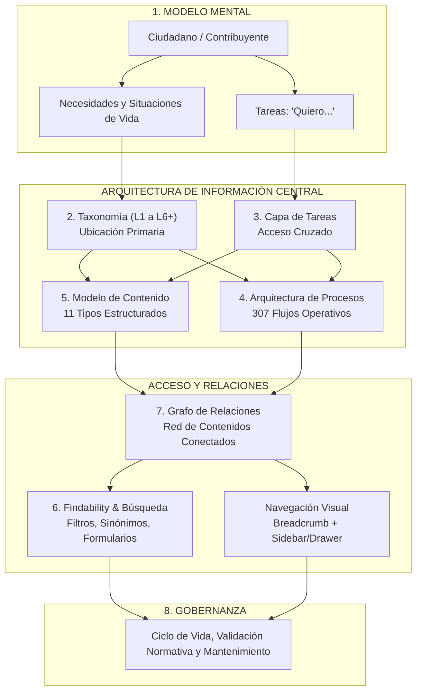
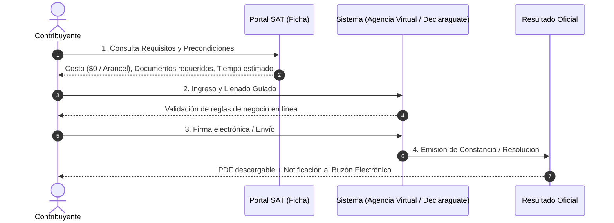
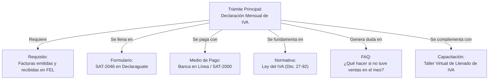
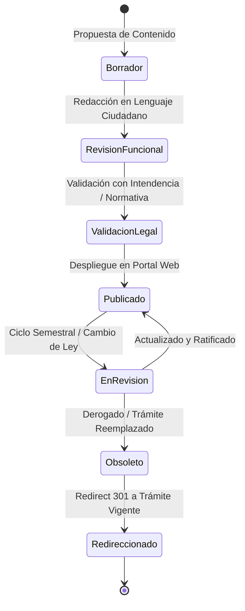

# Marco Integral de Arquitectura de Información Centrada en el Usuario (IA-UX)
## Portal Web — Superintendencia de Administración Tributaria (SAT) Guatemala

> **Regla de Oro de la Arquitectura SAT**:  
> *«Una persona debe identificar rápidamente qué necesita hacer, entender qué debe hacer y completar el proceso sin necesidad de conocer cómo está organizada internamente la SAT ni a qué intendencia pertenece su trámite.»*

---

## 1. Visión y Ecosistema de la IA

La jerarquía organizativa interna de la SAT (intendencias, departamentos, gerencias regionales) es una estructura administrativa, **no una arquitectura de información orientada al ciudadano**. 

La arquitectura de información del portal se fundamenta en un ecosistema desacoplado de 8 capas interconectadas:



---

## 2. Las 8 Capas del Marco de Información

```
┌────────────────────────────────────────────────────────────────────────┐
│ 1. Modelo Mental del Usuario (Situaciones de vida y lenguaje natural)  │
├────────────────────────────────────────────────────────────────────────┤
│ 2. Taxonomía y Clasificación (Ubicación primaria vs. secuencias)       │
├────────────────────────────────────────────────────────────────────────┤
│ 3. Arquitectura Orientada a Tareas (Capa transversal "Quiero...")      │
├────────────────────────────────────────────────────────────────────────┤
│ 4. Arquitectura de Procesos (Estructura de los 307 flujos guiados)     │
├────────────────────────────────────────────────────────────────────────┤
│ 5. Modelo de Contenido (Tipología formal y contratos de metadatos)     │
├────────────────────────────────────────────────────────────────────────┤
│ 6. Findability y Búsqueda (Sinónimos, formularios y recuperación)      │
├────────────────────────────────────────────────────────────────────────┤
│ 7. Red de Relaciones entre Contenidos (Grafo semántico de 783 ítems)   │
├────────────────────────────────────────────────────────────────────────┤
│ 8. Gobernanza de la Información (Propiedad, vigencia y versionado)     │
└────────────────────────────────────────────────────────────────────────┘
```

---

### Capa 1: Modelo Mental del Usuario

El contribuyente llega al portal bajo un problema práctico, una obligación legal urgente o un evento de vida, no buscando unidades administrativas.

| Atributo | Enfoque Administrativo SAT (Rechazado) | Enfoque Centrado en el Usuario (Adoptado) |
| :--- | :--- | :--- |
| **Punto de partida** | *"Gerencia de Contribuyentes Especiales Medianos"* | *"Tengo una pequeña tienda y necesito facturar"* |
| **Vocabulario** | *"Afectación al Régimen Opcional Simplificado"* | *"Pagar el ISR mensual"* |
| **Acción esperada** | *"Descargar providencia / resolución ministerial"* | *"Obtener mi constancia de inscripción en PDF"* |
| **Disparador** | *"Calendario tributario del Decreto 10-2012"* | *"Se vence mi plazo a fin de mes y quiero evitar multas"* |

#### Directrices de Diseño del Modelo Mental:
1. **Acceso por Eventos de Vida (Life Events)**: Comenzar un negocio, comprar un vehículo usado, heredar un bien, contratar un primer empleado, importar mercancía por primera vez.
2. **Neutralidad de Régimen**: El usuario no necesita saber a priori si es "General" o "Simplificado" para encontrar las herramientas de orientación; el portal lo guía mediante filtros de diagnóstico.

---

### Capa 2: Taxonomía y Clasificación (Ubicación Primaria vs. Relaciones)

Para ordenar los 783 trámites sin duplicar información ni generar silos:

$$\text{Contenido Oficial} = \mathbf{1}\text{ Ubicación Primaria (Canónica)} + \mathbf{N}\text{ Puntos de Acceso Relacionales}$$

1. **Ubicación Primaria (Canónica)**:
   - Todo trámite reside en un único nodo del árbol jerárquico (L1 Segmento $\to$ L2 Área $\to$ L3 Contexto $\to$ L4 Tema $\to$ L5 Contenido $\to$ L6+ Procedimiento).
   - Define su URL canónica y su jerarquía en las migas de pan (*Breadcrumbs*).
2. **Relaciones Secundarias (Puntos de Acceso Transversales)**:
   - Servicios de uso universal (como *Agencia Virtual*, *RTU Digital*, *Factura Electrónica FEL*, *Solvencia Fiscal*) **NO se duplican**.
   - Se indexan como recursos contextuales referenciados en múltiples categorías mediante enlaces transversales y etiquetas (*tags*).
3. **Criterios de Salud Taxonómica**:
   - **Comprensión mutua**: Categorías disyuntas sin ambigüedad terminológica.
   - **Balance de profundidad y amplitud**: Evitar categorías "monstruo" con más de 20 trámites sin sub-agrupación, y ramas desiertas con 1 solo ítem.

---

### Capa 3: Arquitectura Orientada a Tareas (Task-Oriented IA)

Concurrente con la estructura de segmentos, el portal expone una capa de acceso directo por verbos de intención ciudadana:

```text
QUIERO...
├── 1. Inscribirme / Registrarme
│   └── Obtener NIT por primera vez, Afiliarme a impuestos, Registrar mi negocio
├── 2. Actualizar mis datos
│   └── Cambiar dirección fiscal, Modificar actividad comercial, Actualizar RTU
├── 3. Emitir y Recibir Facturas
│   └── Habilitar FEL, Emitir DTE desde Agencia Virtual, Certificar facturas
├── 4. Presentar Declaraciones
│   └── Llenar formularios en Declaraguate (IVA, ISR, ISO), Cargar anexos
├── 5. Pagar y Consultar Saldos
│   └── Pagar con Boleta SAT-2000, Consultar omisos, Convenios de pago
├── 6. Consultar y Descargar
│   └── Estado de mi vehículo, Solvencia Fiscal, Constancia de RTU, Retenciones
├── 7. Solicitar Devoluciones y Créditos
│   └── Crédito fiscal para exportadores, Pagos en exceso o indebidos
└── 8. Cerrar o Suspender Actividades
    └── Cese temporal de actividades, Cancelación de personería, Inactivación de NIT
```

> **Regla de Coexistencia**: La capa de tareas **no es un nuevo nivel jerárquico**, sino una dimensión de consulta transversal proyectada en la interfaz mediante accesos directos, selectores rápidos y facetas de filtrado.

---

### Capa 4: Arquitectura de Procesos (Modelo para los 307 Flujos)

Un trámite no es solo texto informativo; **es una secuencia operativa**. Se descompone formalmente cada uno de los 307 procesos en la siguiente estructura estandarizada:



#### Ficha Estructurada de Proceso:
1. **Precondiciones**: Estado de cuenta al día, RTU actualizado, firma electrónica o usuario activo en Agencia Virtual.
2. **Requisitos y Documentación**: Lista exhaustiva en formato de checklist, especificando formato (PDF, escaneo, original).
3. **Costo**: Gratuito o arancel aplicable, con código de formulario bancario de pago.
4. **Tiempos de Respuesta**: Tiempo promedio de validación automática o manual por parte del revisor SAT.
5. **Sistemas Involucrados**: Declaraguate, Agencia Virtual, RetenISR, Ventanilla Ágil, DUCA Central.
6. **Resultado Entregable**: Constancia digital, resolución formal, calcomanía electrónica, token de autorización.
7. **Excepciones y Casos Especiales**: Menores de edad, extranjeros no domiciliados, sucesiones indivisas.
8. **Fundamento Legal**: Ley, reglamento y artículo específico resumido en acordeón secundario.

---

### Capa 5: Modelo de Contenido (Content Types y Esquemas)

Para evitar la heterogeneidad y asegurar calidad editorial, se definen **11 tipos de contenido estándar**:

| Tipo de Contenido | Propósito | Campos Obligatorios | Llamado a la Acción (CTA) |
| :--- | :--- | :--- | :--- |
| **1. Guía Paso a Paso** | Orientar en un proceso completo | Audiencia, Pre-requisitos, Pasos cronológicos, Video/Infografía | *"Iniciar trámite en línea"* |
| **2. Ficha de Trámite** | Catálogo formal de un servicio | Segmento, Categoría, Costo, Tiempo, Requisitos, Base legal | *"Ir al servicio"* |
| **3. Consulta en Línea** | Verificación de datos públicos | Parámetro de búsqueda (NIT, Placa, VIN), Instrucciones | *"Consultar ahora"* |
| **4. Formulario** | Instrumento de declaración o pago | Código SAT, Impuesto, Descripción, Formato de llenado | *"Llenar en Declaraguate"* |
| **5. Procedimiento** | Flujo técnico operativo o aduanero | Base normativa, Flujo secuencial, Actores responsables | *"Ver procedimiento oficial"* |
| **6. Requisito** | Documento o condición necesaria | Quién lo emite, Vigencia, Formato aceptado, Ejemplo visual | *"Descargar plantilla"* |
| **7. Documento / Manual** | Material de consulta técnica o legal | Autor, Fecha de aprobación, Versión, Archivo descargable | *"Descargar PDF"* |
| **8. Normativa** | Respaldo legal y resoluciones | Tipo de norma, Número, Fecha de diario oficial, Texto | *"Consultar Ley"* |
| **9. Preguntas Frecuentes** | Resolución rápida de dudas | Pregunta en lenguaje ciudadano, Respuesta concisa, Vínculo | *"¿Te sirvió esta respuesta?"* |
| **10. Herramienta** | Calculadoras y simuladores | Entradas requeridas, Fórmula de cálculo, Aviso de demo | *"Calcular / Simular"* |
| **11. Directorio / Contacto** | Ubicaciones físicas y asistencia | Oficina, Horarios, Mapa, Teléfono, Canales virtuales | *"Agendar cita / Ver mapa"* |

---

### Capa 6: Findability y Arquitectura de Búsqueda

La búsqueda es el canal principal de acceso para más del 60% de los usuarios. El motor debe resolver disparidades entre lenguaje técnico y lenguaje coloquial:

```text
BÚSQUEDA CIUDADANA
         │
         ▼
[ Normalización y Stemming ]  ──► (Elimina tildes, signos, plurales)
         │
         ▼
[ Diccionario de Sinónimos ]   ──► "calca" ➔ Calcomanía de circulación de vehículos
                                  "boleta" ➔ Boleta SAT-2000
                                  "facturas" ➔ FEL / Régimen de Factura Electrónica
                                  "inscripción" ➔ RTU Digital / Asignación de NIT
         │
         ▼
[ Mapeo de Identificadores ]  ──► "SAT-1411" ➔ Declaración mensual de IVA
                                  "SAT-2000" ➔ Recibo de pago tributario
                                  "SAT-8611" ➔ Traspaso de vehículos
         │
         ▼
[ Rejilla de Resultados ]     ──► Título en Lenguaje Ciudadano + Tag de Tipo + CTA directo
```

#### Reglas de Recuperación (Search Rules):
1. **Cero Resultados Prevenidos**: Sugerencias tipo *"Quizás quisiste decir..."*, sinónimos tributarios y opciones alternativas de navegación.
2. **Resultados Paginados y Clasificados**: Filtros dinámicos por **Tipo de Contenido**, **Segmento** y **Canal (Digital / Presencial)**.
3. **Priorización de Trámites Reales sobre Normativa**: Si un usuario busca *"IVA"*, se prioriza el formulario y la guía de pago sobre el PDF del Decreto 27-92.

---

### Capa 7: Red de Relaciones entre Contenidos (Content Graph)

Los 783 contenidos no deben ser islas independientes. Cada página cuenta con un grafo de relaciones semánticas contextuales:



> **Beneficio**: Si el usuario entra por un formulario en un buscador externo (Google), la página le ofrece inmediatamente los requisitos, el medio de pago y las preguntas frecuentes sin obligarlo a explorar el árbol principal.

---

### Capa 8: Gobernanza de la Información

Para garantizar que los contenidos permanezcan exactos, vigentes y auditables:



#### Roles y Matriz RACI:
- **Propietario Funcional (Intendencias SAT)**: Responsable de la veracidad técnica, requisitos legales y aranceles.
- **Equipo de UX / Lenguaje Ciudadano**: Responsable de la redacción clara, estructura paso a paso y diseño de interacción.
- **Equipo de Tecnología**: Responsable del rendimiento técnico, accesibilidad WCAG 2.2 AA y uptime de los servicios.
- **Versionado y Trazabilidad**: Todo contenido registra metadatos obligatorios: `ultima_actualizacion`, `version`, `base_legal_vigente`, `revisor_id`.

---

## 3. Matriz de Implementación y Próximos Pasos

| Capa | Entregable Concreto | Estado Actual | Prioridad |
| :--- | :--- | :---: | :---: |
| **1. Modelo Mental** | Arquetipos de contribuyente y taxonomía de intenciones | Documentado | Alta |
| **2. Taxonomía** | Árbol L1 a L6+ con 783 trámites padre/hijo | Implementado en BD / JSON | Completado |
| **3. Orientada a Tareas** | Módulo de navegación "Quiero..." en catálogo y portada | En diseño interactivo | Muy Alta |
| **4. Procesos** | Ficha estructurada estándar para los 307 procesos | En desarrollo modal | Alta |
| **5. Modelo de Contenido** | Esquema TypeScript/JSON con los 11 tipos de contenido | Especificado | Alta |
| **6. Findability** | Diccionario de sinónimos, códigos SAT y motor de búsqueda | Pendiente de integración | Muy Alta |
| **7. Relaciones** | Enlaces bidireccionales en fichas de trámite | Prototipado | Media |
| **8. Gobernanza** | Manual de actualización y ciclo de revisión semestral | Formalizado en este doc | Media |
