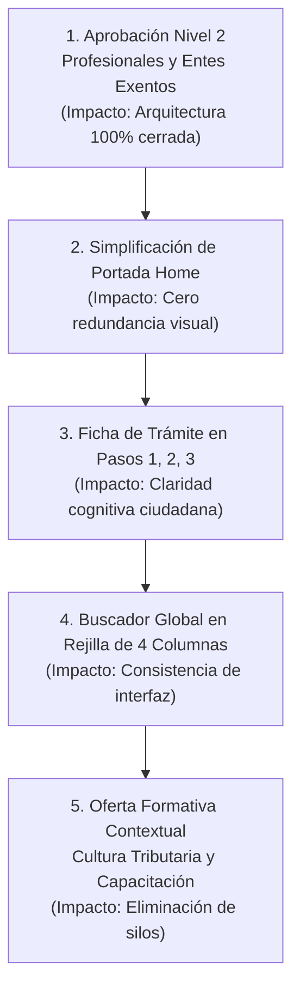

# Documento Técnico: Sugerencias de Continuidad, UX y Arquitectura Portal SAT

> **Superintendencia de Administración Tributaria (SAT Guatemala)**  
> **Objetivo:** Hoja de ruta priorizada para la consolidación de la experiencia ciudadana, jerarquía de contenido y estabilidad del portal web.  
> **Fecha:** Octubre 2026  
> **Versión:** 1.0  

---

## 1. Resumen Ejecutivo de Prioridades

Tras la consolidación de la base de datos oficial (SQLite, ANSI SQL Dump y NoSQL) y la normalización de títulos sin siglas huérfanas sobre los 676 trámites, se identifican **5 áreas prioritarias de intervención** organizadas por impacto y esfuerzo:

---

## 2. Detalle de Sugerencias y Plan de Acción

### Sugerencia 1: Cierre Formal del Nivel 2 en Profesionales y Entes Exentos
* **Justificación técnica:** Actualmente, *Contribuyentes* (4 regímenes) y *Operadores de Comercio Exterior* (3 segmentos) están formalmente validados. Para tener el esqueleto institucional 100% cerrado, se requiere validar los 6 segmentos restantes registrados en el backlog:
  * **Profesionales (3 segmentos):**
    1. *Peritos Contadores y Auditores:* Inscripción, habilitación y gestiones para el ejercicio contable y auditoría.
    2. *Abogados y Notarios:* Servicios tributarios para formalización legal, traspasos notariales y representación jurídica.
    3. *Servicios Profesionales Independientes:* Obligaciones, facturación y retenciones para profesionales colegiados y consultores.
  * **Entes Exentos (3 segmentos):**
    1. *Sector Público y Entidades del Estado:* Gestiones tributarias, retenciones oficiales y registros de dependencias y municipalidades.
    2. *Organizaciones No Gubernamentales y Asociaciones No Lucrativas:* Acreditación de exención, solvencias y obligaciones formales para beneficio social.
    3. *Centros Educativos, Religiosos y Organismos Internacionales:* Gestiones y constancias amparadas por mandato constitucional y convenios.
* **Acción sugerida:** Formalizar esta estructura en la interfaz de navegación y en el catálogo para completar la jerarquía institucional.

---

### Sugerencia 2: Simplificación de la Portada (`Home` - `App.tsx`)
* **Problema diagnosticado:** En la pantalla de inicio conviven simultáneamente:
  1. Las 4 tarjetas de Macro Grupos (`UserSegmentCards`).
  2. El carrusel de accesos directos (`QuickAccessCarousel`).
  3. Las pestañas de temas populares (`PopularTopicsTabs`).
  Esto genera una triple repetición de los mismos enlaces (NIT, Facturación, Vehículos, Solvencia), causando sobrecarga cognitiva al contribuyente.
* **Acción sugerida:** 
  * Retirar o consolidar los bloques secundarios repetitivos.
  * Establecer las **4 tarjetas de Macro Grupos** como el eje central y despejado de navegación ciudadana.
  * Mantener únicamente la barra de búsqueda global y el banner institucional.

---

### Sugerencia 3: Ficha de Trámite Ciudadana en Pasos Secuenciales Numerados
* **Problema diagnosticado:** El modal de detalle (`TramiteDetailModal.tsx`) muestra requisitos y textos en bloques densos. El usuario busca conocer rápidamente *qué hacer*, *dónde ingresar* y *cuál es el orden*.
* **Acción sugerida:**
  1. **Secuencia temporal numerada:** Reorganizar los requisitos en pasos de acción claros (*Paso 1: Ingresa a tu Agencia Virtual*, *Paso 2: Adjunta tus documentos*, *Paso 3: Descarga tu constancia electrónica*).
  2. **Llamado a la acción (CTA) prioritario:** Botón primario de alta visibilidad que redirija directamente al sistema de gestión (Agencia Virtual o Declaraguate).
  3. **Base legal secundaria:** Mover los fundamentos normativos y decretos a una sección colapsable (acordeón secundario) para no entorpecer la lectura del ciudadano común.

---

### Sugerencia 4: Consistencia Visual en el Buscador del Header (`Header.tsx`)
* **Problema diagnosticado:** Al realizar una búsqueda en el encabezado institucional, los resultados no coinciden con la cuadrícula ni el lenguaje visual de las tarjetas del catálogo principal.
* **Acción sugerida:**
  * Adoptar una rejilla uniforme de 4 columnas en desktop (`lg:grid-cols-4`).
  * Reutilizar el componente `ui/Card` con fondo neutro y borde institucional para garantizar coherencia visual idéntica en todo el portal.

---

### Sugerencia 5: Integración Contextual de «Cultura Tributaria y Capacitación»
* **Problema diagnosticado:** Los cursos, manuales y talleres de capacitación tributaria y aduanera figuran en algunas vistas como trámites aislados o desvinculados de la gestión operativa.
* **Acción sugerida:**
  * Adoptar la denominación oficial institucional: **«Cultura tributaria y capacitación»** (o *Capacitación y orientación aduanera* en el área aduanera).
  * Vincular cada recurso formativo directamente al régimen y categoría temática correspondiente:
    * *Curso: Obligaciones del Pequeño Contribuyente* ➔ dentro del segmento *Pequeños Contribuyentes*.
    * *Capacitación: Factura y DUCA (FYDUCA)* ➔ dentro de *Importadores y Exportadores*.
    * *Guía: Timbres Fiscales y Protocolo* ➔ dentro de *Abogados y Notarios*.

---

## 3. Matriz de Seguimiento en Roadmaps

| Sugerencia | Roadmap Asociado | Ítem en Backlog | Estado |
| :--- | :--- | :---: | :---: |
| **Cierre Nivel 2 Profesionales / Exentos** | [Roadmap 03](./../roadmaps/03_ROADMAP_BACKLOG_PORTAL.md) | Sección 7 | Documentado / Listo para ejecutar |
| **Simplificación de Portada Home** | [Roadmap 03](./../roadmaps/03_ROADMAP_BACKLOG_PORTAL.md) | Sección 1 | Documentado / Listo para ejecutar |
| **Ficha de Trámite en Pasos (1, 2, 3)** | [Roadmap 03](./../roadmaps/03_ROADMAP_BACKLOG_PORTAL.md) | Sección 2 | Documentado / Listo para ejecutar |
| **Rejilla 4 Columnas en Buscador** | [Roadmap 03](./../roadmaps/03_ROADMAP_BACKLOG_PORTAL.md) | Sección 4 | Documentado / Listo para ejecutar |
| **Cultura Tributaria Contextual** | [Roadmap 03](./../roadmaps/03_ROADMAP_BACKLOG_PORTAL.md) | Sección 5 | Documentado / Listo para ejecutar |
