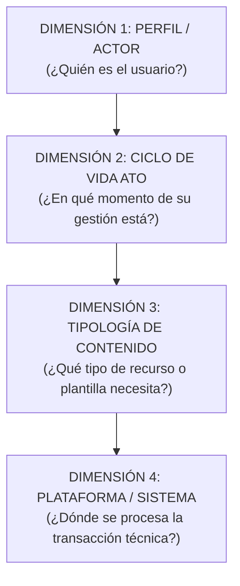

# Modelo de Taxonomía, Dimensiones y Arquitectura de Información

> **Superintendencia de Administración Tributaria (SAT Guatemala)**  
> **Arquitectura de Información para el Nuevo Portal Web Institucional**  
> **Inspiración Metodológica:** Australian Taxation Office (ATO) & GOV.UK Design System  
> **Versión:** 4.2 (Definitiva y Sincronizada con Producción, 716 Trámites Consolidados)  
> **Fecha de Actualización:** Octubre 2026  
> **Dataset Maestro (Single Source of Truth):** [`src/data/allTramites.json`](file:///c:/Users/busqu/Documents/GitHub/SAT/src/data/allTramites.json)  
> **Libros Excel Entregables (Vivos):**  
> * [`docs/fuentes-datos/Estructura_Final_Contenido_Portal_SAT_Actualizado.xlsx`](file:///c:/Users/busqu/Documents/GitHub/SAT/docs/fuentes-datos/Estructura_Final_Contenido_Portal_SAT_Actualizado.xlsx)  
> * [`docs/fuentes-datos/Mapa_de_Navegacion_y_Descripciones_Portal_SAT.xlsx`](file:///c:/Users/busqu/Documents/GitHub/SAT/docs/fuentes-datos/Mapa_de_Navegacion_y_Descripciones_Portal_SAT.xlsx)  
> **Fuentes Históricas de Referencia (Congeladas):**  
> * [`docs/fuentes-datos/Detalle de Contenido para Grupos de Interes.xlsx`](file:///c:/Users/busqu/Documents/GitHub/SAT/docs/fuentes-datos/Detalle%20de%20Contenido%20para%20Grupos%20de%20Interes.xlsx)  
> * [`docs/fuentes-datos/Arbol_de_Navegacion_Portal_v5.xlsx`](file:///c:/Users/busqu/Documents/GitHub/SAT/docs/fuentes-datos/Arbol_de_Navegacion_Portal_v5.xlsx)

---

## 1. Fundamento de la Arquitectura Multidimensional

Un portal público de alta densidad (716 trámites, servicios, guías y normativas oficiales) no puede estructurarse como un árbol estático de carpetas. Si se entierra el contenido en menús profundos, los usuarios no encuentran lo que buscan y saturan las agencias tributarias y aduaneras.

Para resolver esto, el nuevo portal de la SAT opera bajo una **arquitectura de 4 dimensiones interconectadas**:

---

## 2. Dimensión 1: Segmento y Rol del Actor (Navegación Primaria)

Estructurada en **4 grandes audiencias nacionales** para permitir la segmentación precisa del usuario sin saturar la pantalla principal, aplicando el estándar de interfaz de una sola línea (benchmark ATO):

| No. | Macro Grupo (Nivel 1) | Texto Orientador de Interfaz (Estándar ATO) | Alcance Operativo | Base Jurídica Oficial | Trámites |
| :---: | :--- | :--- | :--- | :--- | :---: |
| **1** | **Contribuyentes** | *Información y servicios tributarios para personas y empresas.* | Personas individuales sin actividad económica activa, asalariados en relación de dependencia, pequeños contribuyentes, régimen general del IVA e ISR, propietarios de vehículos y medianos/grandes contribuyentes especiales. | CPRG (Art. 135d), Código Tributario (Dto. 6-91), Ley del IVA (Dto. 27-92), LAT (Dto. 10-2012), Ley ISCV (Dto. 70-94). | **344** |
| **2** | **Operadores de Comercio Exterior** | *Servicios e información aduanera para la importación, exportación y logística.* | Dueños de mercancías (importadores/exportadores), prestadores de servicios logísticos autorizados (AFPA, transportistas, depósitos, consolidadores, courier) y empresas en regímenes territoriales especiales (ZDEEP, Maquilas). | Código Tributario (Dto. 6-91), CAUCA IV (Res. 223-2008 COMIECO), RECAUCA (Res. 224-2008 COMIECO), Ley de Maquilas (Dto. 29-89), Ley ZOLIC (Dto. 22-73). | **246** |
| **3** | **Entes Exentos** | *Información y gestiones tributarias para entidades públicas y organizaciones no lucrativas.* | Personas jurídicas, entidades del sector público, organismos diplomáticos, centros educativos, universidades, comunidades religiosas, ONGs y fundaciones exentas por mandato constitucional o ley específica. | CPRG (Arts. 37, 73, 88 y 257), Ley del IVA (Dto. 27-92, Art. 8), LAT (Dto. 10-2012, Art. 11), Código Municipal (Dto. 12-2002), Ley de ONGs (Dto. 02-2003). | **79** |
| **4** | **Profesionales** | *Herramientas y servicios especializados para profesionales tributarios y auxiliares.* | Abogados y notarios (traspasos vehiculares electrónicos y fe pública), peritos contadores, contadores públicos y auditores (CPA) y gestores tributarios acreditados. | Código de Notariado (Dto. 314), Ley de Colegiación Profesional Obligatoria (Dto. 72-2001), Dto. 2450, Ley de Timbres Fiscales (Dto. 37-92), Código Tributario (Arts. 57 "A" y 112). | **47** |
| **TOTAL** | — | — | — | — | **716** |

---

## 3. Desglose Canónico: Profesionales (47 Trámites)

El segmento de Profesionales organiza sus servicios en 5 categorías funcionales:

1. **Abogados y Notarios (18 trámites netos):**
   * *Habilitación y Registro Profesional (4):* Inscripción RTU, activación en AV, huella biométrica y ratificación anual.
   * *Timbres Fiscales y Papel Sellado (5):* SAT-7130, retiro de especies con procurador, razón electrónica en línea, devolución/canje y capacitación virtual.
   * *Traspaso Electrónico Vehicular - e-Traspaso (4):* Habilitación Notario TEV, formalización en línea, carga con firma avanzada y autorización notarial.
   * *Avisos Notariales ante la SAT (5):* Legalización de firmas vehicular, transferencia de dominio, consulta de avisos registrados, calendario de plazos y ventanilla preferencial.
2. **Peritos Contadores (11 trámites):**
   * *Habilitación y Registro (4):* Inscripción de Perito Contador, registro en AV, actualización y baja.
   * *Consultas, Retenciones y Libros (7):* LET, FEL, planilla IVA-FEL, retenciones IVA/ISR, autoliquidación, compensaciones y sistemas web.
3. **Auditores — Contadores Públicos y Auditores (4 trámites):**
   * *Habilitación y Registro CPA (2):* Inscripción y actualización de CPA.
   * *Dictámenes de Crédito Fiscal (2):* Registro y actualización de auditor emisor de dictámenes de devolución de crédito fiscal.
4. **Gestores Tributarios y Auxiliares (8 trámites):**
   * *Acreditación y Carné Oficial (4):* Marco de actuación, requisitos iniciales, carné integral y gestiones en RTU.
   * *Renovación y Gestión de Gafetes (4):* Renovación, reposición por extravío/deterioro, padrón activo e inhabilitación.
5. **Servicios Profesionales Generales (6 trámites):**
   * Facturación por honorarios en Declaraguate, actualización de RTU, consultas legales vinculantes, objeciones técnicas a criterios jurídicos, retenciones hospitalarias y cumplimiento tributario voluntario.

---

## 4. Gobernanza de Datos y Fuentes

La arquitectura documental del repositorio opera bajo una regla estricta:

* **Fuentes Históricas (Congeladas):** `Detalle de Contenido para Grupos de Interes.xlsx` y `Arbol_de_Navegacion_Portal_v5.xlsx` se mantienen como el registro inalterable de auditoría institucional.
* **Entregables Vivos (Sincronizados):** `Estructura_Final_Contenido_Portal_SAT_Actualizado.xlsx` y `Mapa_de_Navegacion_y_Descripciones_Portal_SAT.xlsx` reflejan exactamente los 716 registros consolidados de `src/data/allTramites.json`.
