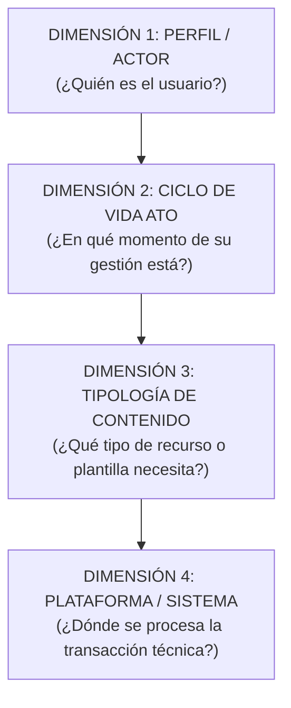

# Modelo de Taxonomía, Dimensiones y Arquitectura de Información

> **Superintendencia de Administración Tributaria (SAT Guatemala)**  
> **Arquitectura de Información para el Nuevo Portal Web Institucional**  
> **Inspiración Metodológica:** Australian Taxation Office (ATO) & GOV.UK Design System  
> **Versión:** 4.1 (Definitiva y Sincronizada con Producción, 718 Trámites Consolidados)  
> **Fecha de Actualización:** Octubre 2026  
> **Dataset Maestro (Single Source of Truth):** [`src/data/allTramites.json`](file:///c:/Users/busqu/Documents/GitHub/SAT/src/data/allTramites.json)  
> **Libros Excel Entregables (Vivos):**  
> * [`docs/fuentes-datos/Estructura_Final_Contenido_Portal_SAT_Actualizado.xlsx`](file:///c:/Users/busqu/Documents/GitHub/SAT/docs/fuentes-datos/Estructura_Final_Contenido_Portal_SAT_Actualizado.xlsx)  
> * [`docs/fuentes-datos/Mapa_de_Navegacion_y_Descripciones_Portal_SAT.xlsx`](file:///c:/Users/busqu/Documents/GitHub/SAT/docs/fuentes-datos/Mapa_de_Navegacion_y_Descripciones_Portal_SAT.xlsx)  
> **Fuentes Históricas de Referencia (Congeladas):**  
> * [`docs/fuentes-datos/Detalle de Contenido para Grupos de Interes.xlsx`](file:///c:/Users/busqu/Documents/GitHub/SAT/docs/fuentes-datos/Detalle%20de%20Contenido%20para%20Grupos%20de%20Interes.xlsx)  
> * [`docs/fuentes-datos/Arbol_de_Navegacion_Portal_v5.xlsx`](file:///c:/Users/busqu/Documents/GitHub/SAT/docs/fuentes-datos/Arbol_de_Navegacion_Portal_v5.xlsx)

---

## 1. Fundamento de la Arquitectura Multidimensional

Un portal público de alta densidad (718 trámites, servicios, guías y normativas oficiales) no puede estructurarse como un árbol estático de carpetas. Si se entierra el contenido en menús profundos, los usuarios no encuentran lo que buscan y saturan las agencias tributarias y aduaneras.

Para resolver esto, el nuevo portal de la SAT opera bajo una **arquitectura de 4 dimensiones interconectadas**:



---

## 2. Dimensión 1: Segmento y Rol del Actor (Navegación Primaria)

Estructurada en **4 grandes audiencias nacionales** para permitir la segmentación precisa del usuario sin saturar la pantalla principal, aplicando el estándar de interfaz de una sola línea (benchmark ATO):

| No. | Macro Grupo (Nivel 1) | Texto Orientador de Interfaz (Estándar ATO) | Alcance Operativo | Base Jurídica Oficial | Trámites |
| :---: | :--- | :--- | :--- | :--- | :---: |
| **1** | **Contribuyentes** | *Información y servicios tributarios para personas y empresas.* | Personas individuales sin actividad económica activa, asalariados en relación de dependencia, pequeños contribuyentes, régimen general del IVA e ISR, propietarios de vehículos y medianos/grandes contribuyentes especiales. | CPRG (Art. 135d), Código Tributario (Dto. 6-91), Ley del IVA (Dto. 27-92), LAT (Dto. 10-2012), Ley ISCV (Dto. 70-94). | **344** |
| **2** | **Operadores de Comercio Exterior** | *Servicios e información aduanera para la importación, exportación y logística.* | Dueños de mercancías (importadores/exportadores), prestadores de servicios logísticos autorizados (AFPA, transportistas, depósitos, consolidadores, courier) y empresas en regímenes territoriales especiales (ZDEEP, Maquilas). | Código Tributario (Dto. 6-91), CAUCA IV (Res. 223-2008 COMIECO), RECAUCA (Res. 224-2008 COMIECO), Ley de Maquilas (Dto. 29-89), Ley ZOLIC (Dto. 22-73). | **246** |
| **3** | **Entes Exentos** | *Información y gestiones tributarias para entidades públicas y organizaciones no lucrativas.* | Personas jurídicas, entidades del sector público, organismos diplomáticos, centros educativos, universidades, comunidades religiosas, ONGs y fundaciones exentas por mandato constitucional o ley específica. | CPRG (Arts. 37, 73, 88 y 257), Ley del IVA (Dto. 27-92, Art. 8), LAT (Dto. 10-2012, Art. 11), Código Municipal (Dto. 12-2002), Ley de ONGs (Dto. 02-2003). | **79** |
| **4** | **Profesionales** | *Herramientas y servicios especializados para profesionales tributarios y auxiliares.* | Abogados y notarios (traspasos vehiculares electrónicos y fe pública), peritos contadores, contadores públicos y auditores (CPA) y gestores tributarios acreditados. | Código de Notariado (Dto. 314), Ley de Colegiación Profesional Obligatoria (Dto. 72-2001), Dto. 2450, Ley de Timbres Fiscales (Dto. 37-92), Código Tributario (Arts. 57 "A" y 112). | **49** |
| **TOTAL** | — | — | — | — | **718** |

---

## 3. Desglose Canónico: Operadores de Comercio Exterior (246 Trámites)

Comercio Exterior consolida sus operaciones aduaneras en **6 ramas maestras**, estructuradas con precisión por actor y ciclo logístico:

```
OPERADORES DE COMERCIO EXTERIOR (246 Trámites)
│
├── 1. Importadores (55 trámites)
│   ├── Registro y Padrón de Importadores (9)
│   │   └── Requisitos de padrón, altas, bajas, cambio de sector y actualización.
│   ├── Declaraciones Aduaneras y DUCAs (10)
│   │   └── Declaraciones DUCA-D, DUCA-F, DUCA-T y gestiones anticipadas.
│   ├── Despacho Aduanero, Levante y Selectivo (17)
│   │   └── Semáforo de rampa, selectivo rojo/amarillo/verde, inspección física y levante.
│   ├── Importación y Nacionalización de Vehículos (10)
│   │   └── Declaración de importación de vehículos, cálculo de IPRIMA y placas iniciales.
│   └── Mercancías en Abandono, Depósitos y Franquicias (9)
│       └── Subastas aduaneras, rescate de mercancías en abandono y franquicias diplomáticas.
│
├── 2. Exportadores (21 trámites)
│   ├── Padrón y Registro de Exportadores (7)
│   │   └── Inscripción en padrón, enlace con VUPE/SEADEX y solvencia fiscal de exportación.
│   ├── Declaraciones Aduaneras y Embarques (4)
│   │   └── Transmisión electrónica DUCA-D exportación y despacho en puerto/frontera.
│   └── Devolución de Crédito Fiscal (10)
│       └── Régimen general de devolución, régimen especial electrónico y dictámenes CPA.
│
├── 3. Operador Económico Autorizado - OEA (2 trámites)
│   └── Programa OEA (2)
│       └── Certificación como operador confiable y acuerdos de reconocimiento mutuo.
│
├── 4. Auxiliares de la Función Pública Aduanera - AFPA (76 trámites)
│   ├── Agentes Aduaneros (7)
│   │   └── Autorización, patente, examen de suficiencia y registro de dependientes.
│   ├── Apoderados Especiales Aduaneros (16)
│   │   └── Inscripción inicial de mandato, acreditación de empresa y renovación de fianza.
│   ├── Depósitos Aduaneros (36)
│   │   ├── Depósitos Aduaneros Temporales - DAT (18): Recintos portuarios y aeroportuarios.
│   │   ├── Almacenadoras Generales de Depósito - AGD (16): Títulos de crédito y bonos de prenda.
│   │   └── Almacenes Fiscales (2): Custodia afianzada y recintos privados.
│   ├── Empresas de Entrega Rápida o Courier (3)
│   │   └── Despacho expreso aéreo, cambio de régimen a ordinario y garantías.
│   └── Transportistas Aduaneros (14)
│       └── Registro de unidades de transporte, precintos electrónicos y tránsitos DUCA-T.
│
├── 5. Regímenes Territoriales y Zonas Especiales (42 trámites)
│   ├── Maquilas (Decreto 29-89) (12)
│   │   └── Admisión temporal, cuenta corriente, garantías e insumo-producto.
│   └── Zonas de Desarrollo Económico Especial Público - ZDEEP (30)
│       ├── Empresas Usuarias de ZDEEP (15): Operaciones, exenciones y traslados.
│       └── Entidades Administradoras de ZDEEP (15): Habilitación, polígono y garitas.
│
└── 6. Normativa y Operaciones Aduaneras Generales (50 trámites)
    ├── Arancel Centroamericano (SAC) y Permisos (7)
    ├── Acuerdos Comerciales y Facilitación (8)
    ├── Prevención de Contrabando y Defraudación (3)
    ├── Consultas Técnicas, Recursos y Valoración (14)
    └── Modernización e Infraestructura Aduanera (18)
```

---

## 4. Dimensión 2: Ciclo de Vida ATO (Momento de la Gestión)

Cada contenido del portal se ubica en el ciclo de vida natural del contribuyente u operador, erradicando números prefijados en la interfaz visual:

| Etapa ATO | Denominación Visible | Trámites | Propósito en el Viaje del Usuario |
| :--- | :--- | :---: | :--- |
| `empezar` | **Empezar y registrarse** | **98** | Trámites de alta: obtención de NIT, RTU inicial, autorización de auxiliares y habilitación de libros. |
| `operar` | **Operación y declaraciones** | **282** | Rutina periódica: facturación FEL, Declaraguate, DUCAs, retenciones de impuestos y pagos. |
| `consultar` | **Consultas y herramientas** | **135** | Verificadores directos: consulta de Rampa aduanera, solvencia fiscal SOFI, DTE y arancel SAC. |
| `modificar_cerrar` | **Modificaciones y cierre** | **143** | Ciclo de cambio: actualización de RTU, traspaso de vehículos, prescripción, suspensión y cese. |
| `normativa` | **Normativa y asistencia** | **60** | Base jurídica, guías de estudio, resoluciones de Directorio, recursos de revocatoria y criterios técnicos. |

---

## 5. Dimensión 3: Tipología de Contenido y Formato de Interacción

Determina el componente de UI y la interacción que experimentará el usuario:

| Clave Técnica | Etiqueta en Portal | Trámites | Componente y Experiencia |
| :--- | :--- | :---: | :--- |
| `servicio_transaccional` | **Trámite en Línea** | **162** | Botón de acción directo a Declaraguate, Agencia Virtual, VUSP o sistema aduanero. |
| `consulta_datos` | **Consulta a Base de Datos** | **84** | Barra de búsqueda rápida en tiempo real para validaciones inmediatas. |
| `guia_informativa` | **Guía Informativa** | **463** | Ficha estructurada en Lenguaje Ciudadano con requisitos, base legal y pasos. |
| `descarga_recurso` | **Descarga / Software** | **9** | Ficha con enlace directo de descarga a instaladores o plantillas oficiales. |

---

## 6. Dimensión 4: Plataforma y Sistema de Ejecución Técnica

| Plataforma | Trámites | Descripción |
| :--- | :---: | :--- |
| **Agencia Virtual SAT** | 215 | Portal autenticado para personas individuales y jurídicas mediante NIT y contraseña. |
| **Declaraguate** | 128 | Sistema de formularios tributarios electrónicos públicos para cálculo y pago bancario. |
| **Sistemas Aduaneros (SAQD / DUCA)** | 148 | Plataforma informática aduanera para transmisión de declaraciones y manifiestos. |
| **Portales Públicos y Verificadores** | 185 | Servicios web abiertos sin inicio de sesión (Solvencias, Verificador DTE, Rampa). |
| **Otros Sistemas / VUPE / ZOLIC** | 42 | Sistemas interconectados de entidades asociadas al comercio exterior. |

---

## 7. Gobernanza de Datos y Fuentes

La arquitectura documental del repositorio opera bajo una regla estricta:

* **Fuentes Históricas (Congeladas):** `Detalle de Contenido para Grupos de Interes.xlsx` y `Arbol_de_Navegacion_Portal_v5.xlsx` se mantienen como el registro inalterable de auditoría institucional.
* **Entregables Vivos (Sincronizados):** `Estructura_Final_Contenido_Portal_SAT_Actualizado.xlsx` y `Mapa_de_Navegacion_y_Descripciones_Portal_SAT.xlsx` reflejan exactamente los 718 registros consolidados de `src/data/allTramites.json`.
