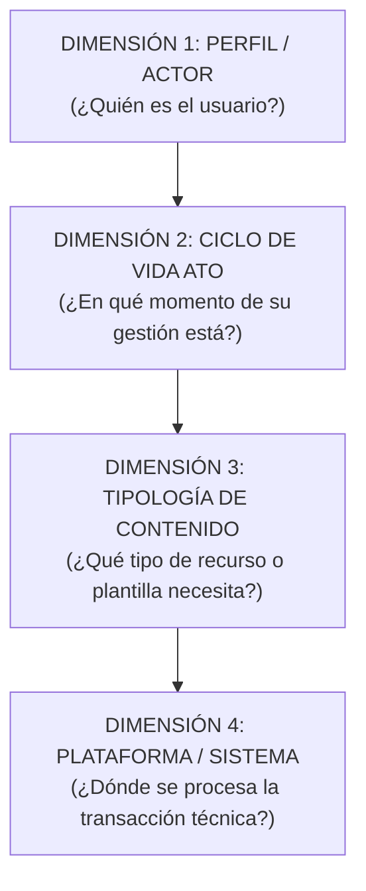

# Modelo de Taxonomía, Dimensiones y Arquitectura de Información

> **Superintendencia de Administración Tributaria (SAT Guatemala)**  
> **Arquitectura de Información para el Nuevo Portal Web Institucional**  
> **Inspiración Metodológica:** Australian Taxation Office (ATO) & GOV.UK Design System  
> **Versión:** 4.0 (Definitiva y Saneada, 676 Trámites Consolidados)  
> **Fecha de Actualización:** Octubre 2026  
> **Repositorio:** [`docs/TAXONOMIA_Y_DIMENSIONES_PORTAL_SAT.md`](file:///c:/Users/busqu/Documents/GitHub/SAT/docs/TAXONOMIA_Y_DIMENSIONES_PORTAL_SAT.md)  
> **Dataset Maestro (Single Source of Truth):** [`src/data/allTramites.json`](file:///c:/Users/busqu/Documents/GitHub/SAT/src/data/allTramites.json)  
> **Libro Excel de Entrega:** [`docs/Estructura_Final_Contenido_Portal_SAT.xlsx`](file:///c:/Users/busqu/Documents/GitHub/SAT/docs/Estructura_Final_Contenido_Portal_SAT.xlsx)

---

## 1. Fundamento de la Arquitectura Multidimensional

Un portal público de alta densidad (676 trámites, servicios, guías y normativas canónicas) no puede estructurarse como un árbol estático de carpetas. Si se entierra el contenido en menús profundos, los usuarios no encuentran lo que buscan y saturan las agencias tributarias y aduaneras.

Para resolver esto, el nuevo portal de la SAT opera bajo una **arquitectura de 4 dimensiones interconectadas**:



---

## 2. Dimensión 1: Segmento y Rol del Actor (Navegación Primaria)

Estructurada en **4 grandes audiencias nacionales** para permitir la segmentación precisa del usuario sin saturar la pantalla principal, aplicando el estándar de interfaz de una sola línea (benchmark ATO):

| No. | Macro Grupo (Nivel 1) | Texto Orientador de Interfaz (Estándar ATO) | Alcance Operativo | Base Jurídica Oficial |
| :---: | :--- | :--- | :--- | :--- |
| **1** | **Contribuyentes** | *Información y servicios tributarios para personas y empresas.* | Personas individuales sin actividad económica activa, asalariados en relación de dependencia, pequeños contribuyentes, régimen general del IVA e ISR, propietarios de vehículos y medianos/grandes contribuyentes especiales. | CPRG (Art. 135d), Código Tributario (Dto. 6-91), Ley del IVA (Dto. 27-92), LAT (Dto. 10-2012), Ley ISCV (Dto. 70-94). |
| **2** | **Operadores de Comercio Exterior** | *Servicios e información aduanera para la importación, exportación y logística.* | Dueños de mercancías (importadores/exportadores), prestadores de servicios logísticos autorizados (AFPA, transportistas, depósitos, consolidadores, courier) y empresas en regímenes territoriales especiales (ZDEEP, Zonas Francas, Maquilas). | Código Tributario (Dto. 6-91), CAUCA IV (Res. 223-2008 COMIECO), RECAUCA (Res. 224-2008 COMIECO), Ley de Maquilas (Dto. 29-89). |
| **3** | **Profesionales** | *Herramientas y servicios especializados para profesionales tributarios y auxiliares.* | Abogados y notarios (traspasos vehiculares electrónicos y fe pública), peritos contadores, contadores públicos y auditores (CPA) y gestores tributarios acreditados. | Código de Notariado (Dto. 314), Ley de Colegiación Profesional Obligatoria (Dto. 72-2001), Dto. 2450, Ley de Timbres Fiscales (Dto. 37-92), Código Tributario (Arts. 57 "A" y 112). |
| **4** | **Entes Exentos** | *Información y gestiones tributarias para entidades públicas y organizaciones no lucrativas.* | Personas jurídicas, entidades del sector público, organismos diplomáticos, centros educativos, universidades, comunidades religiosas, ONGs y fundaciones exentas por mandato constitucional o ley específica. | CPRG (Arts. 37, 73, 88 y 257), Ley del IVA (Dto. 27-92, Art. 8), LAT (Dto. 10-2012, Art. 11), Código Municipal (Dto. 12-2002), Ley de ONGs (Dto. 02-2003). |

```
NIVEL 1: SEGMENTOS (4 Grandes Audiencias Nacionales)
  ├── Contribuyentes
  ├── Operadores de Comercio Exterior
  ├── Profesionales
  └── Entes Exentos
```

### Desglose Especial: Operadores de Comercio Exterior (Aduanas)

Dado el alto volumen técnico y normativo (246 trámites), Comercio Exterior despliega sus niveles completos:

```
NIVEL 2: ÁREAS DE OPERACIÓN ADUANERA
  ├── Titulares de Mercancías (Régimen General Definitivo)
  ├── Regímenes Especiales, Perfeccionamiento y Zonas de Fomento
  ├── Auxiliares de la Función Pública Aduanera (AFPA)
  └── Programas Especiales de Facilitación y Cumplimiento

NIVEL 3: SUB-ÁREAS
  ├── [De Titulares]: Importación Definitiva │ Exportación Definitiva
  ├── [De Regímenes Especiales]: Maquilas (Dto. 29-89) │ ZDEEP (Dto. 22-73) │ Zonas Francas (Dto. 65-89)
  ├── [De AFPA]: Despacho y Representación │ Logística y Transporte │ Recintos y Custodia
  └── [De Facilitación]: Operador Económico Autorizado (OEA)

NIVEL 4: ACTORES ESPECÍFICOS Y SUJETOS DE TRÁMITE
  ├── Titulares de Mercancías:
  │     ├── Importadores Habituales (Empresas comerciales / industriales en padrón)
  │     ├── Importadores Ocasionales / Menores (Compras personales y paquetería)
  │     ├── Exportadores Habituales (Registro VUPE / SEADEX)
  │     └── Exportadores bajo Régimen Especial (Devolución de Crédito Fiscal IVA)
  │
  ├── Regímenes Especiales y Fomento:
  │     ├── Empresas Calificadas bajo Maquila y Admisión Temporal (Decreto 29-89)
  │     ├── Entidades Administradoras de ZDEEP y Zonas Francas
  │     └── Empresas Usuarias Instaladas en ZDEEP y Zonas Francas
  │
  ├── Auxiliares de la Función Pública Aduanera (AFPA):
  │     ├── Agentes Aduaneros (Patente personal de despacho aduanero)
  │     ├── Apoderados Especiales Aduaneros (Representación exclusiva de empresas)
  │     ├── Transportistas Aduaneros (Terrestres internacionales, marítimos, aéreos)
  │     ├── Consolidadores y Desconsolidadores de Carga Internacional
  │     ├── Empresas de Entrega Rápida o Courier (Envíos expresos)
  │     └── Depositarios Aduaneros:
  │           ├── Almacenes Fiscales (Depósitos aduaneros públicos/privados)
  │           ├── Almacenadoras Generales de Depósito (Títulos de crédito)
  │           └── Depósitos Aduaneros Temporales - DAT (Puertos y aeropuertos)
  │
  └── Programas Especiales de Facilitación:
        └── Empresas Certificadas OEA (Canal verde prioritario)
```

---

## 3. Dimensión 2: Ciclo de Vida ATO (Navegación Secundaria)

Inspirado en el modelo de la **Australian Taxation Office (ATO)**, organiza cada trámite según el momento vital del usuario. **Regla de presentación:** Los textos visibles al usuario final **no llevan números prefijados**.

| Etapa ATO | Denominación Visible | Propósito Operativo | Ejemplos en Comercio Exterior |
| :--- | :--- | :--- | :--- |
| `empezar` | **Empezar y registrarse** | Habilitación en padrones, acreditación inicial, carnés, garantías y fianzas operativas. | • Registro en Padrón de Importadores<br>• Inscripción de Agente Aduanero<br>• Fianza de Operación Courier |
| `operar` | **Operación y declaraciones** | Presentación de declaraciones (DUCA), liquidación de tributos, transmisión de manifiestos y despacho. | • Transmisión DUCA-D / DUCA-T<br>• Cobro por Permanencia (SCP)<br>• Registro ATC Terrestre |
| `consultar` | **Consultas y herramientas** | Verificadores públicos en tiempo real, consulta de selectivo, rampa, arancel SAC y expedientes. | • Consulta de Asignación de Rampa<br>• Tránsitos Aduaneros Pendientes<br>• Arancel Centroamericano (SAC) |
| `modificar_cerrar` | **Modificaciones y cierre** | Renovación anual de licencias, ampliación de plazos, reexportación, comiso, abandono o cese. | • Renovación Anual AFPA<br>• Prórroga de Admisión Temporal ATC<br>• Declaración de Abandono y Subasta |
| `normativa` | **Normativa y asistencia** | Marco legal, criterios de clasificación arancelaria, sanciones, capacitaciones y recursos legales. | • Compendio CAUCA / RECAUCA<br>• Criterios de Clasificación Arancelaria<br>• Procedimiento de Impugnación |

---

## 4. Dimensión 3: Tipología Editorial de Contenido (Content Archetypes)

Esta dimensión define **qué tipo de contenido es** y determina los componentes de UI y la plantilla de página en el portal web:

```
┌────────────────────────────────────────────────────────────────────────┐
│                   TIPOLOGÍA EDITORIAL DE CONTENIDO                     │
├─────────────────────────┬──────────────────────────────────────────────┤
│ 1. Trámite Transaccional│ "Hazlo aquí" (App interactiva / Formulario)  │
│ 2. Guía de Requisitos   │ "Cómo se hace" (Paso a paso, requisitos)     │
│ 3. Consulta / Buscador  │ "Búscalo aquí" (Verificador en tiempo real)   │
│ 4. Norma / Criterio     │ "Cuál es la regla" (Base legal, resoluciones)│
│ 5. Recurso Descargable  │ "Descárgalo" (Software, plantillas, tablas)  │
│ 6. Novedad / Aviso      │ "Entérate" (Alertas de aduana, comunicados)  │
│ 7. Multimedia           │ "Aprende" (Video tutorial, infografía)       │
└─────────────────────────┴──────────────────────────────────────────────┘
```

### Detalle de Especificación de Plantillas

#### 1. Trámite Transaccional (`tramite_interactivo` / `servicio_transaccional`)
- **Propósito**: Ejecutar una gestión o intercambio de datos directo con la SAT.
- **Componentes en Pantalla**:
  - Botón de acción principal con autenticación (SSO Agencia Virtual o Transmisión Web).
  - Estado del trámite / Sesión activa.
  - Formulario interactivo o cargador de archivos (XML/JSON/Excel).
  - Comprobante digital descargable con firma electrónica.

#### 2. Guía de Requisitos y Pasos (`guia_informativa`)
- **Propósito**: Orientar al usuario con claridad antes de iniciar una gestión física o digital.
- **Componentes en Pantalla**:
  - Resumen en Lenguaje Claro (*¿Para qué sirve?*).
  - Lista estructurada de requisitos obligatorios y documentos de soporte.
  - Pasos secuenciales numerados (1, 2, 3).
  - Costo del trámite (o indicación de *Gratuito*).
  - Tiempo de resolución estimado (SLA).
  - Enlace al aplicativo transaccional correspondiente.

#### 3. Consulta Pública / Buscador (`consulta_datos`)
- **Propósito**: Validar o consultar información en tiempo real sin abrir expediente ni requerir login.
- **Componentes en Pantalla**:
  - Caja de búsqueda predictiva y filtros paramétricos.
  - Tabla dinámica de resultados responsiva.
  - Semáforo de estatus (Vigente, Retenido, En Ruta, Cancelado).
  - Opción de exportar a PDF o Excel.

#### 4. Normativa, Criterio y Guía Legal (`normativa_legal`)
- **Propósito**: Otorgar certeza jurídica y fundamentación técnica sobre la ley tributaria y aduanera.
- **Componentes en Pantalla**:
  - Ficha de metadatos (Número de Acuerdo, fecha de publicación, vigencia).
  - Resumen ejecutivo del criterio en Plain Language.
  - Visor PDF embebido accesible y descargable.
  - Historial de reformas y leyes conexas vinculadas.

#### 5. Recurso / Software Descargable (`descarga_recurso`)
- **Propósito**: Proveer herramientas técnicas, drivers, instaladores o plantillas de trabajo local.
- **Componentes en Pantalla**:
  - Tarjeta de descarga con versión y fecha de compilación.
  - Requisitos de hardware y sistema operativo.
  - Guía rápida de instalación en 3 pasos.
  - Hash de integridad de seguridad (SHA-256).

#### 6. Aviso Operativo / Comunicado (`aviso_operativo`)
- **Propósito**: Notificar incidencias de última hora, pasos fronterizos inhabilitados o mantenimientos.
- **Componentes en Pantalla**:
  - Banner de alerta con nivel de severidad (Informativo, Advertencia, Urgente).
  - Aduanas o recintos afectados.
  - Ruta alterna o plan de contingencia operativo.
  - Fecha y hora estimada de normalización.

---

## 5. Dimensión 4: Plataforma Tecnológica y Backbone de Ejecución

Declara el sistema tecnológico específico de la SAT donde corre la transacción:

| Código Plataforma | Nombre del Sistema | Alcance Técnico |
| :--- | :--- | :--- |
| `agencia_virtual` | **Agencia Virtual SAT** | Portal autenticado para personas individuales y jurídicas (RTU Digital, solvencias, buzón). |
| `declaraguate` | **Declaraguate** | Sistema de generación y pago de formularios tributarios y pólizas aduaneras de oficio. |
| `duca_web` | **Sistema de Transmisión DUCA / DUA** | Plataforma de aduana sin papeles para firma digital y transmisión de DUCAs. |
| `saqbe_aduanas` | **Sistema Aduanero SAQB'E / TICA** | Motor central de aduanas para control de selectivo, rampa, aforo y levante. |
| `scp` | **Sistema de Cobro por Permanencia** | Módulo web para liquidación y cobro de tarifas de almacenaje fiscal. |
| `atc_terrestre` | **Sistema ATC Terrestre** | Registro y control de unidades de transporte extranjero en admisión temporal. |
| `marchamo_sicom` | **Sistema de Marchamo Electrónico** | Plataforma de trazabilidad satelital y monitoreo GPS de carga en tránsito. |
| `vupe_seadex` | **Ventanilla Única de Exportaciones** | Sistema interconectado SAT - MINECO - AGEXPORT para tramitación de exportaciones. |

---

## 6. Arquitectura de Información y Mecanismos de Navegación

### A. Capas de la Arquitectura de Información
La arquitectura conceptual se define en capas con profundización libre:
- **Nivel 1 — Segmento / Audiencia:** Macro-audiencia nacional (ej. *Contribuyentes*).
- **Nivel 2 — Área / Dominio:** Gran ámbito temático o régimen (ej. *Empleo y salarios*).
- **Nivel 3 — Contexto / Subárea:** Situación o condición del usuario (ej. *Trabajar en relación de dependencia*).
- **Nivel 4 — Tema / Hub:** Agrupador o sección local (ej. *ISR para empleados*).
- **Nivel 5 — Contenido / Servicio:** Unidad funcional concreta (ej. *Retenciones de ISR*). No sesgado a trámites, ya que el 67% son guías informativas. La tipología de interacción define su modalidad técnica.
- **Nivel 6+ — Profundización libre:** Subcontenido, procedimiento, variante o cálculo sin límite de profundidad (ej. *Cálculo de la retención › Ejemplo y tablas*).

### B. Modelo de Base de Datos: Relacional Padre/Hijo
Para soportar profundización dinámica sin modificar el esquema físico:
```sql
-- Modelo jerárquico Padre/Hijo recomendado para la base de datos del Portal SAT
CREATE TABLE portal_taxonomia (
    id VARCHAR(64) PRIMARY KEY,
    parent_id VARCHAR(64) REFERENCES portal_taxonomia(id) ON DELETE RESTRICT,
    nombre VARCHAR(255) NOT NULL,
    slug VARCHAR(255) NOT NULL,
    nivel INT NOT NULL,
    orden INT DEFAULT 0
);
```

### C. Mecanismos Funcionales de Navegación
1. **Breadcrumb (Ubicación Jerárquica Dinámica):**
   - Representa la ubicación jerárquica y se adapta a la profundidad de la ruta y al espacio disponible.
   - En desktop puede mostrar la ruta completa o compactarla cuando sea excesiva.
   - En móvil utiliza compactación elíptica: `'Inicio'` es el ancla raíz y no computa contra el límite de 2–3 niveles de contenido (`Inicio › […] › ISR para empleados › Retenciones`). Al pulsar `[…]` despliega los niveles intermedios.
2. **Sidebar (Navegación Contextual Local):**
   - Despliega el contexto local relevante (Nivel 4 en adelante).
   - *Tener Nivel 7 u 8 en la arquitectura no implica construir un Sidebar de 7 u 8 niveles.* Muestra el árbol inmediato relevante del hub activo.
3. **Contenido Central (Página Actual):**
   - Ficha de servicio, guía, consulta o aplicativo activo (Nivel 5+).
4. **Enlaces Contextuales (Navegación Transversal):**
   - Vínculos directos entre contenidos relacionados sin forzar navegación vertical en el árbol.

---

## 7. Estructura de Datos de la Ficha Maestra (Schema JSON)

Cada trámite dentro de [`src/data/allTramites.json`](file:///c:/Users/busqu/Documents/GitHub/SAT/src/data/allTramites.json) cumple con esta especificación completa de 5 niveles ATO y trazabilidad:

```json
{
  "id": "comercio_exterior-af-scp",
  "pillar": "comercio_exterior",
  "pillarName": "Operadores de Comercio Exterior",
  "macroGrupo": "Operadores de Comercio Exterior",
  "grupoNo": 8,
  "grupoNombre": "Auxiliares de la Función Pública Aduanera (AFPA)",
  "familiaAduanera": "Auxiliares de la Función Pública Aduanera (AFPA)",
  "subfamiliaAduanera": "Custodia y Recintos Fiscales",
  "actorEspecifico": "Depositarios Aduaneros (Almacenes Fiscales)",
  "categoria": "Almacenes Fiscales",
  "subcategoria": "Operaciones y trámites",
  "tema": "Régimen de Depósito Aduanero",
  "subtema": "Liquidación y Permanencia",
  "tramite": "Sistema de Cobro por Permanencia de Mercancías (SCP)",
  "descripcion": "Aplicativo web oficial para consultar y liquidar las tarifas por días de permanencia de mercancías bajo control aduanero en almacén fiscal antes del levante.",
  "nivel1_segmento": "Operadores de Comercio Exterior",
  "nivel2_area": "Auxiliares de la Función Pública Aduanera (AFPA)",
  "nivel3_subarea": "Almacenes Fiscales",
  "nivel4_tema": "Operaciones y trámites",
  "nivel5_tramite": "Sistema de Cobro por Permanencia de Mercancías (SCP)",
  "etapaAto": "operar",
  "etapaAtoLabel": "Operación y declaraciones",
  "tipoInteraccion": "servicio_transaccional",
  "tipoInteraccionLabel": "Trámite / Aplicativo en Línea",
  "tipologiaContenido": "tramite_interactivo",
  "tipologiaContenidoLabel": "Trámite Transaccional",
  "plataformaSistema": "scp",
  "plataformaSistemaLabel": "Sistema de Cobro por Permanencia (SCP)",
  "canalAtencion": "100% Digital",
  "url": "https://portal.sat.gob.gt/portal/sistema-de-cobro-por-permanencia/",
  "rutasProceso": [
    {
      "procesoMacro": "Auxiliares de la Función Pública Aduanera",
      "eventoInicio": "Ingreso y custodia de mercancías en recinto aduanero",
      "descripcion": "Liquidación electrónica de permanencia de bultos",
      "normativa": "CAUCA / RECAUCA"
    }
  ],
  "esBrecha": false
}
```

---

## 8. Mapeo y Trazabilidad de Contenidos

| Área Principal | Sub-área / Actor | Tema de Gestión | Etapa ATO Mapeada | Tipología de Contenido |
| :--- | :--- | :--- | :--- | :--- |
| **AFPA** | Apoderados Especiales Aduaneros | Registro y acreditación | **Empezar y registrarse** | Guía de Requisitos / Trámite |
| **AFPA** | Apoderados Especiales Aduaneros | Operaciones y trámites | **Operación y declaraciones** | Trámite Transaccional |
| **AFPA** | Apoderados Especiales Aduaneros | Consultas y seguimiento | **Consultas y herramientas** | Consulta / Buscador |
| **AFPA** | Apoderados Especiales Aduaneros | Normativa y recursos | **Normativa y asistencia** | Normativa y Criterios |
| **AFPA** | Almacenes Fiscales | Registro / Operaciones / Consultas | 5 Etapas ATO | Matriz por contenido |
| **AFPA** | Almacenadoras Generales de Depósito | Registro / Operaciones / Consultas | 5 Etapas ATO | Matriz por contenido |
| **AFPA** | Depósitos Aduaneros Temporales (DAT) | Registro / Operaciones / Consultas | 5 Etapas ATO | Matriz por contenido |
| **Regímenes Especiales** | Entidades Administradoras ZDEEP | Registro / Operaciones / Consultas | 5 Etapas ATO | Matriz por contenido |
| **Regímenes Especiales** | Usuarios Calificados de ZDEEP | Registro / Operaciones / Consultas | 5 Etapas ATO | Matriz por contenido |
| **Regímenes Especiales** | Maquilas (Decreto 29-89) | Registro / Operaciones / Consultas | 5 Etapas ATO | Matriz por contenido |
| **Regímenes Especiales** | Zonas Francas (Decreto 65-89) | Registro / Operaciones / Consultas | 5 Etapas ATO | Matriz por contenido |
