# Arquitectura del Viaje del Usuario y Contribuyente - SAT Guatemala

Este documento define la lógica oficial del **Viaje del Usuario (Taxpayer & User Journey)** para la organización, categorización y ordenación de trámites en el Portal Web de la SAT Guatemala a través de sus **4 Segmentos Institucionales (783 trámites consolidados)**, alineado rigurosamente al documento normativo institucional:
📂 **`docs/Detalle de Contenido para Grupos de Interes.xlsx`** y al modelo internacional de la **Australian Taxation Office (ATO)**.

---

## 1. Principio Fundamental y Aclaración de Arquitectura

> [!IMPORTANT]
> **Erradicación de "Trámites comunes" y Jerga Administrativa:** 
> La categoría "Trámites comunes" provino de una agregación artificial en una versión intermedia del árbol de navegación. Conforme al archivo oficial de diseño **`Detalle de Contenido para Grupos de Interes.xlsx`**, **NO EXISTE** una categoría "Trámites comunes".
> Los trámites vehiculares, de RTU y declaraciones pertenecen legítimamente a los grupos tributarios donde opera el contribuyente (`Contribuyente General`, `Pequeños Contribuyentes`, `Contribuyentes Especiales` y `NIT sin Obligaciones`).
> Asimismo, se erradican los números en nombres visibles y términos abstractos como *"canónico"*, priorizando el **Lenguaje Ciudadano**.

```
[Empezar y registrarse] ➔ [Operación y declaraciones] ➔ [Consultas y herramientas] ➔ [Modificaciones y cierre] ➔ [Normativa y asistencia]
```

---

## 2. Los 4 Segmentos Institucionales y sus Grupos Oficiales

```mermaid
flowchart TD
    ROOT["Portal Web SAT Guatemala (783 trámites)"] --> P1["Contribuyentes (413)"]
    ROOT --> P2["Operadores de Comercio Exterior (246)"]
    ROOT --> P3["Profesionales (45)"]
    ROOT --> P4["Entes Exentos (79)"]

    subgraph P1_SUBS["Segmento 1: Contribuyentes (4 Grupos Oficiales)"]
        P1 --> P1_NIT["NIT sin Obligaciones"]
        P1 --> P1_PEQ["Pequeños Contribuyentes"]
        P1 --> P1_GEN["Contribuyente General"]
        P1 --> P1_ESP["Contribuyentes Especiales"]
    end

    subgraph P2_SUBS["Segmento 2: Comercio Exterior (Cadena Logística)"]
        P2 --> P2_IMP["Importadores"]
        P2 --> P2_EXP["Exportadores"]
        P2 --> P2_TRA["Transportistas"]
        P2 --> P2_AGE["Agentes y Apoderados Aduaneros"]
        P2 --> P2_ALM["Almacenes Fiscales y Recintos"]
        P2 --> P2_ZON["Zonas Francas y ZDEEP"]
        P2 --> P2_COU["Empresas de Entrega Rápida / Courier"]
        P2 --> P2_OEA["Operador Económico Autorizado (OEA)"]
        P2 --> P2_NOR["Normativa y Aranceles"]
    end

    subgraph P3_SUBS["Segmento 3: Profesionales"]
        P3 --> P3_ABO["Abogados y Notarios"]
        P3 --> P3_PER["Peritos Contadores"]
        P3 --> P3_AUD["Auditores"]
        P3 --> P3_GES["Gestores Tributarios"]
        P3 --> P3_SER["Servicios Profesionales"]
    end

    subgraph P4_SUBS["Segmento 4: Entes Exentos"]
        P4 --> P4_EST["Entidades del Estado"]
        P4 --> P4_CON["Constitucionales y Universidades"]
        P4 --> P4_NOL["Organizaciones No Lucrativas e Iglesias"]
        P4 --> P4_MUN["Municipalidades"]
        P4 --> P4_DEC["Entidades por Decreto Especial"]
    end
```



---

## 3. Segmento 1: Contribuyentes (413 trámites)

Estructura simétrica oficial en Lenguaje Ciudadano:

1. **`NIT sin Obligaciones`:** Exclusivo para personas individuales, estudiantes y graduados sin actividad económica que requieren NIT para actos civiles, cuentas bancarias, remesas, registro de títulos universitarios y acceso a información pública.
   * *Nodos de gestión:*
     * **Inscripción de NIT:** Solicitud de primer NIT y actualización de datos de identificación personal.
     * **Títulos Universitarios:** Registro de títulos universitarios para ejercer y verificación digital mediante código QR.
     * **Información Pública:** Solicitud formal de información pública y portal de información de oficio (Decreto 57-2008).
     * **Servicios en Línea y Solvencias:** Agencia Virtual, consulta de expedientes, Solvencia Fiscal en línea y cita previa.
2. **`Pequeños Contribuyentes`:** Régimen simplificado (5% IVA definitivo hasta Q150,000 anuales), agropecuario primario y pecuario.
   * *Nodos de gestión:* Regímenes tributarios, Otros servicios al contribuyente, Capacitación y orientación, Inscripción en RTU, Facturación electrónica FEL.
3. **`Contribuyente General`:** Personas y empresas con actividad comercial, Régimen Sobre las Utilidades, Opcional Simplificado, IVA General (12%), Rentas del Trabajo (asalariados), trámites del Registro Fiscal de Vehículos como propietario, declaraciones y gestiones de RTU.
   * *Nodos de gestión ramificados según Ley de Miller:*
     * **RTU e Inscripción:** Sociedades, empresas, representantes legales, domicilios fiscales, suspensiones y ceses.
     * **Obligaciones, Regímenes y Facturación:** Regímenes tributarios, Declaraguate, Facturación electrónica FEL, retenciones.
     * **Devoluciones de Impuestos:** Devoluciones de ISR, crédito fiscal IVA, pagos en exceso o indebidos.
     * **Registro Fiscal de Vehículos (Propietarios):** Primeras placas, traspasos electrónicos notariales, distintivos electrónicos (tarjeta y calcomanía), Impuesto de Circulación (ISCV), rectificaciones e inactivaciones.
     * **Servicios y Consultas:** Solvencias fiscales, verificación de documentos, Agencia Virtual y citas.
     * **Cultura Tributaria y Capacitación:** Cursos virtuales, diplomados, guías interactivas y bibliotecas tributarias en contexto.
4. **`Contribuyentes Especiales`:** Gerencias de Grandes y Medianos Contribuyentes Especiales, precios de transferencia, buzón preferente y fiscalización especializada.

---

## 4. Segmento 2: Operadores de Comercio Exterior (246 trámites)

Organizado según las 4 familias operativas aduaneras y los actores de la cadena logística:

1. **`Importadores`:** Padrón de importadores, transmisión DUCA, despacho de mercancías, valoración aduanera, manifiestos y levante aduanero.
2. **`Exportadores`:** Padrón de exportadores, VUPE/SEADEX, DUCA-F y Régimen Especial de Devolución de Crédito Fiscal.
3. **`Transportistas`:** Empresas de transporte internacional terrestre, aéreo y marítimo, tránsito aduanero comunitario, marchamos electrónicos GPS (SICOM) y manifiestos de carga.
4. **`Agentes y Apoderados Aduaneros`:** Habilitación, carné oficial, licencias de despacho, garantías, pólizas y refrendo de auxiliares aduaneros.
5. **`Depósitos Aduaneros y Almacenes Fiscales`:** Almacenes fiscales públicos/privados, Almacenadoras Generales de Depósito, Depósitos Aduaneros Temporales (DAT) y Sistema de Cobro por Permanencia (SCP).
6. **`Zonas de Desarrollo y Regímenes Especiales`:** Maquilas y Admisión Temporal (Decreto 29-89), Zonas Francas (Decreto 65-89) y Agencias ZDEEP (Decreto 22-73).
7. **`Empresas de Entrega Rápida / Courier`:** Envíos expresos y despacho aduanero de paquetería internacional.
8. **`Operador Económico Autorizado (OEA)`:** Habilitación, auditorías de seguridad y beneficios de canal verde prioritario.
9. **`Normativa y Aranceles`:** Sistema Arancelario Centroamericano (SAC), criterios vinculantes de clasificación, CAUCA/RECAUCA y resoluciones anticipadas.

---

## 5. Segmento 3: Profesionales (45 trámites)

1. **`Abogados y Notarios`:** Traspaso electrónico notarial de vehículos, compra de especies y timbres fiscales, verificación previa de solvencias y legalizaciones.
2. **`Peritos Contadores`:** Registro de Contadores en RTU Digital, acreditación bienal, libros electrónicos, retenciones y balances generales.
3. **`Auditores`:** Contadores Públicos y Auditores (CPA), dictámenes fiscales de estados financieros y auditorías externas.
4. **`Gestores Tributarios`:** Acreditación formal de gestor tributario, carné institucional y representación de terceras personas.
5. **`Servicios Profesionales`:** Profesionales liberales independientes, registro y verificación de títulos universitarios para el ejercicio profesional.

---

## 6. Segmento 4: Entes Exentos (79 trámites)

1. **`Entidades del Estado`:** Ministerios, dependencias del Organismo Ejecutivo, Judicial y Legislativo, SINACIG, vehículos oficiales y transferencias judiciales.
2. **`Constitucionales`:** Universidades, colegios y centros educativos exentos conforme al artículo 73 de la Constitución Política.
3. **`Organizaciones No Lucrativas e Iglesias`:** Asociaciones benéficas, fundaciones, ONG, cultos religiosos y Constancias de Exención de IVA (CIVA).
4. **`Municipalidades`:** Corporaciones municipales, empresas eléctricas municipales y gestiones edilicias.
5. **`Entidades por Decreto Especial`:** Organismos internacionales, misiones diplomáticas y entidades exentas por leyes específicas de la República.

---

## 7. Reglas de Navegación Profunda y Diseño Dual

* **Modelo Jerárquico:** 5 Niveles ATO base + Nivel 6+ extensible según complejidad temática.
* **Base de Datos:** Modelo relacional Padre/Hijo (`parent_id`) en lugar de columnas rígidas `categoria1..9`.
* **Mecanismos de Navegación:**
  * **Migas de Pan (Breadcrumb):** Muestran los niveles macro superiores (Niveles 1 a 3).
  * **Menú Lateral (Sidebar):** Muestra el árbol local de la sección activa (Nivel 4 en adelante).
  * **Móvil:** Compactación automática con botón elíptico interactivo `[…]` para mantener una interfaz limpia sin importar la profundidad de la gestión.
