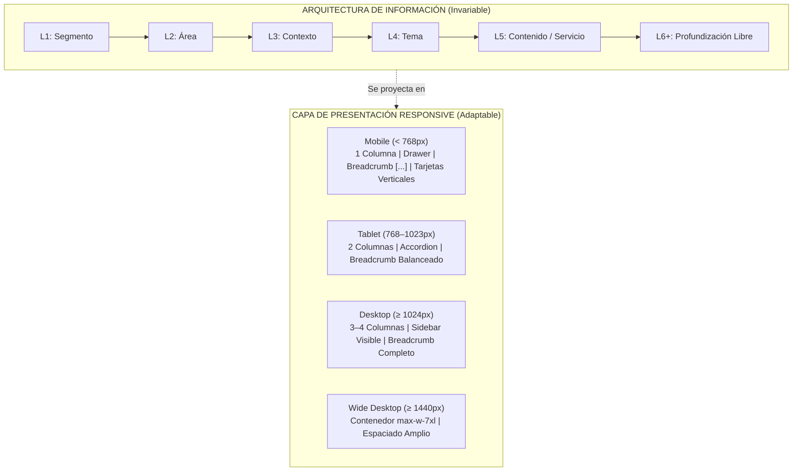
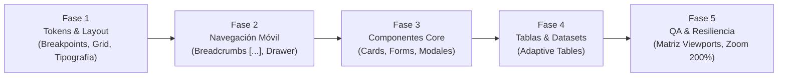

# Plan de Trabajo: Responsive Design & Mobile First — Portal SAT Guatemala

> **Documento Estratégico y Técnico de UI/UX**  
> **Versión:** 1.0 Oficial  
> **Ámbito:** Todo el ecosistema web institucional de la SAT  
> **Regla de Oro:** *Diseñar primero para el espacio disponible más limitado y ampliar progresivamente la experiencia conforme aumenta el viewport, sin alterar la arquitectura de información ni la funcionalidad esencial.*

---

## 1. Fundamento: Desacoplamiento entre Presentación e Información



* **Lo que NO cambia (Invariables del Negocio):** Nomenclatura oficial, catálogo de 783 contenidos, jerarquía taxonómica (L1 a L6+), reglas tributarias y aduaneras, acciones disponibles y contrastes WCAG.
* **Lo que SÍ cambia (Variables de Presentación):** Distribución de columnas, densidad visual, comportamiento de menús (Sidebar $\leftrightarrow$ Drawer), presentación de tablas (Tabla $\leftrightarrow$ Ficha) y compactación del Breadcrumb.

---

## 2. Los 15 Pilares del Sistema Responsive

### 1. Sistema Oficial de Breakpoints
| Rango | Ancho Viewport | Dispositivos Clave | Estrategia de Layout |
| :--- | :--- | :--- | :--- |
| **Mobile** | `< 768px` | Smartphones (320px – 430px) | 1 columna, Drawer off-canvas, Breadcrumb con `[…]`, full-width buttons. |
| **Tablet** | `768px – 1023px` | iPads, Tablets, Plegables | 2 columnas, menús colapsables contextuales. |
| **Desktop** | `1024px – 1439px` | Laptops estándar, Monitores HD | 3 a 4 columnas, Sidebar vertical fijo visible, Breadcrumb expandido. |
| **Wide Desktop** | `≥ 1440px` | Pantallas 2K/4K, Ultrawide | `max-w-7xl` (1280px centrado), márgenes laterales generosos, cero dispersión. |

### 2. Metodología Mobile First
El CSS y los componentes se construyen desde estilos base para pantallas pequeñas (`default` en Tailwind / CSS nativo), agregando complejidad mediante prefijos `md:`, `lg:` y `xl:`. Nunca escribir CSS desktop para luego "comprimirlo" con hacks restrictivos.

### 3. Matriz de Invariabilidad vs. Variabilidad
* **Invariable:** Texto en Lenguaje Claro, cero números en títulos, URLs de Deep Linking, seguridad y validaciones legales.
* **Variable:** Grid de tarjetas (`1 col` en mobile $\rightarrow$ `2 col` en tablet $\rightarrow$ `3-4 col` en desktop).

### 4. Sistema de Layout Unificado
* **Contenedor Maestro:** `w-full max-w-7xl mx-auto`.
* **Padding Lateral (Gutter):** `px-4` (16px) en móvil, `px-6` (24px) en tablet, `px-8` (32px) en desktop.
* **Separación entre Secciones:** `space-y-6` (24px) en móvil $\rightarrow$ `space-y-10` (40px) en desktop.

### 5. Escala Tipográfica Responsive
| Elemento | Móvil (`< 768px`) | Tablet (`768–1023px`) | Desktop (`≥ 1024px`) |
| :--- | :--- | :--- | :--- |
| **H1 (Título de Página)** | `text-2xl` (24px / line-height 32px) | `text-3xl` (30px) | `text-4xl` (36px / line-height 44px) |
| **H2 (Sección / Hub)** | `text-xl` (20px) | `text-2xl` (24px) | `text-2xl` (24px) |
| **H3 (Subtema / Tarjeta)**| `text-base` (16px) | `text-lg` (18px) | `text-lg` (18px) |
| **Cuerpo (Body)** | `text-sm` (14px) | `text-sm` (14px) | `text-base` (16px) |
| **Texto Secundario** | `text-xs` (12px) | `text-xs` (12px) | `text-xs` (12px) |

### 6. Navegación Responsive
* **Desktop:** Header institucional $\rightarrow$ Breadcrumb dinámico $\rightarrow$ Sidebar de sección (Nivel 4+) $\rightarrow$ Contenido.
* **Móvil:** Header compacto con hamburguesa accesible $\rightarrow$ Breadcrumb elíptico (`Inicio › […] › Hub › Contenido`) $\rightarrow$ Botón flotante *"Ver temas de esta sección"* que abre un Drawer lateral $\rightarrow$ Contenido.

### 7. Formularios y Declaraciones SAT
* Campos de entrada a ancho completo (`w-full`).
* Labels permanentemente visibles arriba del input (prohibido depender únicamente de placeholders).
* Tipos de teclado virtual obligatorios: `inputMode="numeric"` (para NIT, DPI, placas y montos), `type="email"`, `type="tel"`.
* Mensajes de validación inmediatos y adyacentes al campo (`text-xs text-red-600`).
* Botones de acción primarios de mínimo **48px de altura** táctil.

### 8. Tablas de Datos y Aranceles
* **Tablas Informativas Simples:** Contenedor con `overflow-x-auto` y sombra indicadora de scroll horizontal.
* **Listados Complejos / Búsqueda:** Transformación automática: en desktop tabla tabular de 6 columnas; en móvil tarjetas apiladas de resumen.

### 9. Comportamiento Responsive por Componente
| Componente | En Móvil (`< 768px`) | En Desktop (`≥ 1024px`) |
| :--- | :--- | :--- |
| **Card SAT** | Tarjeta vertical, padding `p-4`, texto fluido | Tarjeta interactiva con hover sólido, `p-6` |
| **Breadcrumbs** | `Inicio › […] › Tema › Contenido` | Ruta completa navegable con truncamiento inteligente |
| **SidebarNav** | Drawer modal deslizante desde el lateral | Barra vertical fija integrada en grid |
| **Modal / Ficha** | Pantalla completa con cabecera fija de cierre | Ventana modal centrada `max-w-2xl` con fondo atenuado |

### 10. Ergonomía Táctil y Accesibilidad
* **Área Táctil Mínima:** 44 × 44 px (estándar Apple/WCAG) o 48 × 48 px (Android).
* **Cero dependencias de `hover`:** Cualquier acción accesible vía hover en desktop debe ser activable por clic/tap directo en móvil.
* **Foco Visible:** Anillo de foco de alto contraste (`focus:ring-2 focus:ring-sat-azul focus:outline-none`) para navegación por teclado o switch devices.
* **Zoom 200%:** La página no debe romper el layout ni generar scroll horizontal en zoom del 200%.

### 11. Optimización de Medios e Imágenes
* Formato vectorial SVG para logotipos, sellos e iconografía funcional.
* Cero imágenes de texto renderizado (el texto de requisitos debe ser siempre texto HTML seleccionable).
* Carga diferida nativa (`loading="lazy"`).

### 12. Rendimiento Móvil (Core Web Vitals)
* LCP (Largest Contentful Paint) $< 2.5$ s en conexiones móviles 4G.
* CLS (Cumulative Layout Shift) $< 0.1$ reservando dimensiones fijas de banners y contenedores.
* Cero JavaScript bloqueante en el render inicial.

### 13. Contenido Escaneable en Pantallas Pequeñas
* Plain Language riguroso: párrafos de máximo 3 líneas en móvil.
* Listas con viñetas en lugar de párrafos densos para requisitos tributarios.
* Información crítica primero (*Above the fold*): costo, canal de atención y requisitos clave antes de la base legal.

### 14. Matriz de Pruebas por Viewport
| Viewport | Clasificación | Dispositivo / Entorno Representativo | Criterio de Aceptación |
| :---: | :---: | :--- | :--- |
| **320 px** | Mobile Extra Pequeño | iPhone SE (1ª gen) / Pantallas angostas | Cero scroll horizontal, textos legibles sin solapamiento. |
| **360 px** | Mobile Estándar Android | Samsung Galaxy A / Dispositivos de gama media | Ancho base de navegación y formularios de ancho completo. |
| **390 px** | Mobile iOS Moderno | iPhone 12 / 13 / 14 / 15 / 16 | Experiencia táctil óptima y espaciado nativo. |
| **768 px** | Tablet Portrait | iPad Mini / iPad estándar vertical | Grid a 2 columnas equilibrado, menús legibles. |
| **1024 px** | Tablet Landscape / Laptop | iPad Pro / Laptop compacta (13") | Activación de Sidebar visible y Breadcrumb completo. |
| **1280 px** | Desktop Estándar | Monitores de oficina / Laptops de 15" | Cuadrícula a 3–4 columnas holgada. |
| **1440 px** | Wide Desktop | Monitores externos 2K | Contenedor centrado `max-w-7xl` con márgenes limpios. |
| **1920 px** | Full HD Desktop | Pantallas corporativas | Sin estiramiento artificial de tarjetas ni tipografía huérfana. |

### 15. Pruebas de Contenido Extremo y Resiliencia
1. **Nombres de Trámites Ultralargos:** Trámites de más de 120 caracteres no deben romper tarjetas ni tablas.
2. **Arquitectura en Nivel 8:** En móvil el breadcrumb debe compactar con `[…]` y no desbordar.
3. **Zoom de Navegador al 200%:** Todos los controles deben mantenerse accesibles y funcionales.
4. **Modo Sin Conexión / Carga Lenta:** Estados de carga esqueléticos (*skeletons*) sin saltos de layout.

---

## 3. Hoja de Ruta de Implementación en 5 Fases



* **Fase 1: Cimientos de Diseño (Breakpoints, Layout y Escalas):** Actualizar `tokens.css` y `DESIGN_RULES.md` con los 4 breakpoints oficiales y la escala tipográfica responsive.
* **Fase 2: Navegación Responsive:** Integrar el componente `SidebarNav` con drawer móvil en el catálogo y afinar `Breadcrumbs.tsx`.
* **Fase 3: Componentes Adaptables:** Revisar tarjetas, botones y modales para garantizar áreas táctiles $\ge 48$px.
* **Fase 4: Tablas y Formularios:** Implementar vista responsiva para tablas arancelarias y datasets tributarios.
* **Fase 5: Matriz de Certificación:** Ejecutar la suite de pruebas desde 320px hasta 1920px y pruebas de contenido extremo.

---

## 4. Jerarquía de Referencias Normativas Oficiales

```
DESIGN SYSTEM SAT GUATEMALA
           ↓
    AUTORIDAD PRINCIPAL
(Manual V.5, tokens institucionales y componentes vivos)
           ↓
   REFERENCIAS EXTERNAS
(Aportan estándares técnicos y mejores prácticas públicas)
           ↓
├── GOV.UK Design System (Servicios públicos, formularios, tablas y lenguaje ciudadano)
├── MDN Web Docs (Estándar técnico web: media queries, viewports, grid fluido)
├── W3C WCAG 2.2 AA (Accesibilidad obligatoria: reflow, zoom 200%, touch targets ≥ 44px)
├── web.dev (Rendimiento móvil moderno y Core Web Vitals)
└── Material Design Responsive Layouts (Referencia conceptual abstracta de grids; cero estética Material)
```

> **Principio de Autoridad:** *Las referencias externas aportan buenas prácticas; el **Design System SAT** es la autoridad visual y de componentes del portal.*  
> **Exclusión Formal:** *Microsoft Fluent 2 queda fuera de la bibliografía de referencia para asegurar un enfoque 100% nativo de web pública institucional.*
